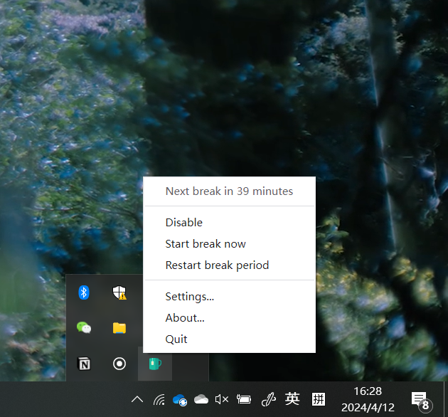
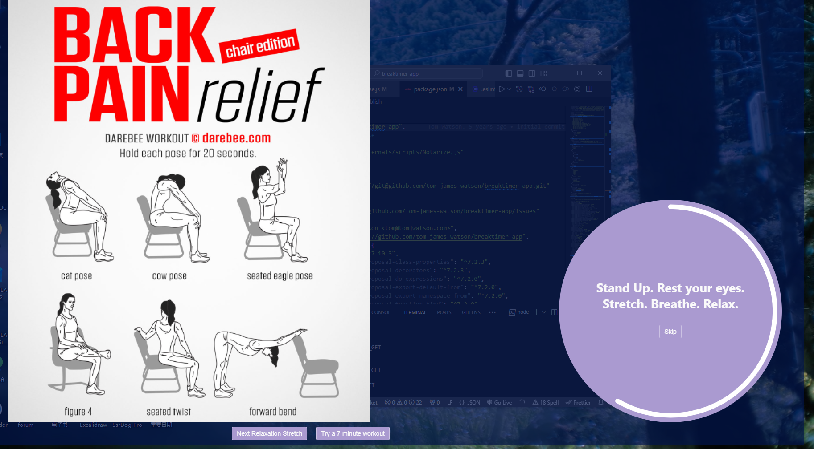
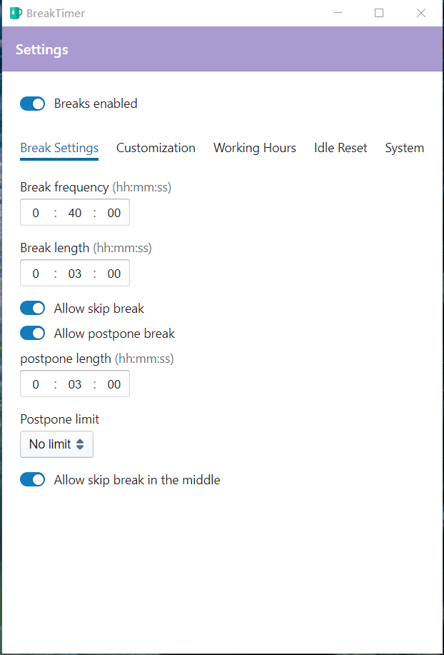
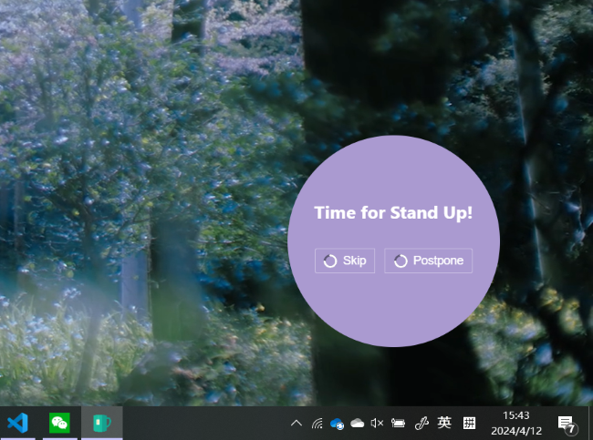
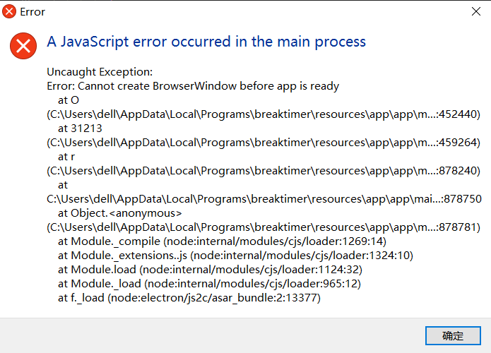

# BreakTimer App

BreakTimer is a desktop application for managing and prompting regular physical breaks. BreakTimer is available for Windows.

BreakTimer allows you to customize:

- How long your breaks are and how often do you wish to have them
- Working hours so you are only reminded when you want to be
- The content of messages shown during breaks.
- Whether to intelligently restart your break countdown when it detects that you have not been using the computer.
- Whether to allow skipping or postponing a scheduled break, or skipping a started break.

## Installation

- **Windows** - [BreakTimer.exe](https://github.com/tom-james-watson/breaktimer-app/releases/latest/download/BreakTimer.exe) (unsigned - you may receive a warning on install, press more info -> run anyway)

## Usage Guide

After installation, the app starts running in the background. You can easily access it from the system tray icon with a left or right click to open the menu. For your convenience, the app will also automatically launch whenever you start your computer. However, if you ever need to close it, simply right-click the icon in your system tray and choose "Quit." You can always restart the app by clicking the shortcut on your desktop.

## 

## Screenshots

## 

## 

## 

## FAQ

### How can I pass you my log files to help you debug an issue?

You can find the log file for BreakTimer here:

Windows: `C:\Users\<USERNAME>\AppData\Roaming\BreakTimer\logs/main.log`

### How can I hard reset the app's data

In case a bug has left the UI in an unrecoverable state, you can reset the app data by exiting the app, deleting the below folder, and starting the app again.

Windows: `C:\Users\<USERNAME>\AppData\Roaming\BreakTimer`

## Reference/ Credit

This software is built upon the amazing open-source work of the Breaktimer app by Tom James: https://github.com/tom-james-watson/breaktimer-app. You can check their software available for macOS, Windows and Linux here: https://breaktimer.app/.

This project is for my research on understanding and reducing knowledge workers' sedentary behavior.

## Known bug

Once the app is running, you can access it from the system tray. This means you won't need to use the desktop icon anymore. If you try to launch the app from the desktop icon after the app has been running, you'll see a error message, but don't worry! The running app itself won't be affected. You can simply close the message window.

## 
